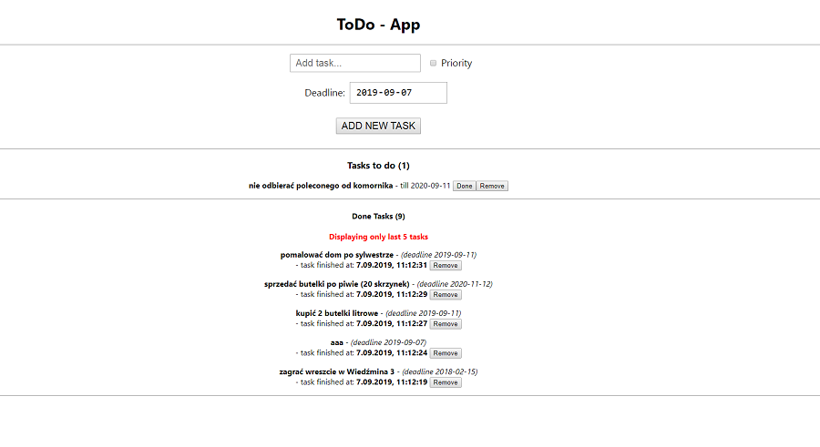

# TODO-App - React.js

This is simple ToDo App created in React.js. It's funcionality is to add tasks to current task. Task is an object
which can take task title, priority and deadline to finish  task. Once task is added to list of tasks it can be removed
right away or moved to section tasks done. If tasks is added with priority it is displayed on red color. There is also
sort funcionality implemented in it. Tasks to do are sorted according alphabet and tasks already done are sorted according
date.

## Tools & Technology used

- Visual Studio Code
- React.js
